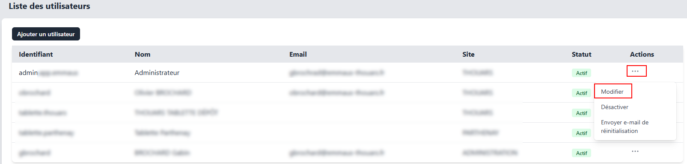

# Modification d'un utilisateur  
:::note
L'accès à cette interface nécéssite l'accès au module **Administration**
:::

Pour modifier un compte utilisateur, accédez à la section **Gestion des utilisateurs**, cliquez sur le bouton **...** situé sur la ligne de l'utilisateur à modifier, puis sélectionnez **Modifier**.  
  

Effectuez les modifications souhaitées, puis validez en cliquant sur le bouton **Mettre à jour**.  
Si vous ne souhaitez pas modifier le mot de passe, laissez le champ correspondant vide.  

:::warning
La modification d'un utilisateur peut entraîner sa déconnexion.
:::
