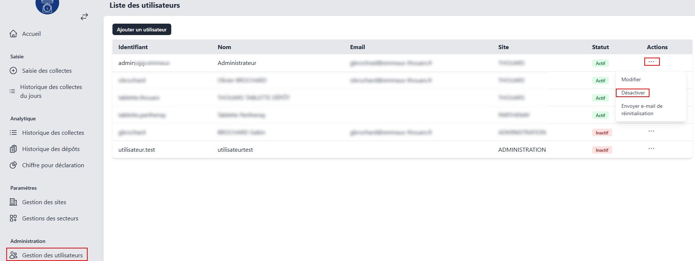
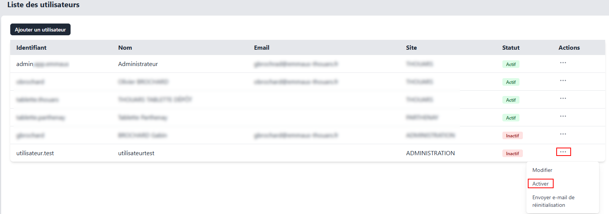

# Désactivation/Réactivation d'un utilisateur  

Pour désactiver ou réactiver un compte utilisateur, accédez à la section **Gestion des utilisateurs**, cliquez sur le bouton **...** situé sur la ligne de l'utilisateur concerné, puis sélectionnez **Désactiver** ou **Activer**.  

**Désactivation :**
  

**Réactivation :**
  
