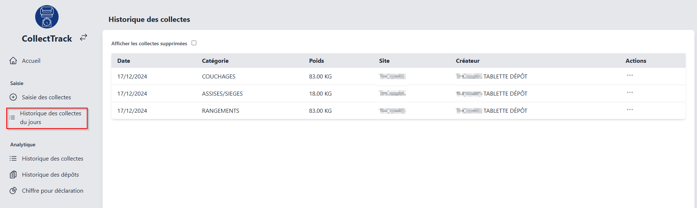
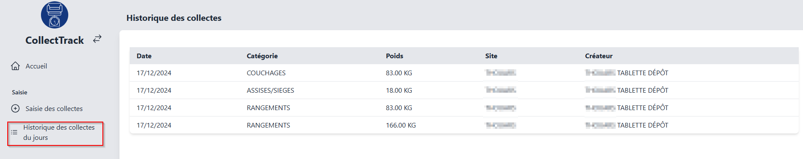

# Consulter l'historique des collectes
## Consulter l'historique des collectes du jours
:::note
### Droits utilisateurs

L'interface de cette page peut changer en fonction des droits des utilisateurs :
Si l'utilisateur à le droit **opérateur** il auras la colonne action en plus lui permettant de supprimer une collecte.  
De plus un utilisateur avec le droit **opérateur** pourra afficher les collectes supprimer et les restaurer.
:::

Pour consulter l'historique des collectes saisi aujourd'hui, accédez à la page **Historique des collectes du jours**.
**Avec droit "opérateur"**

**Sans droit "opérateur"**

## Consulter l'historique complet des collectes
Pour consulter l'historique complet des collectes, accédez à la page **Historique des collectes** dans la section **Analytique**.

## Supprimer une collecte
*Il est aussi possible de supprimer une collecte depuis l'interface **Historique des collectes du jour***

## Consulter les collectes supprimée

## Restaurer une collecte