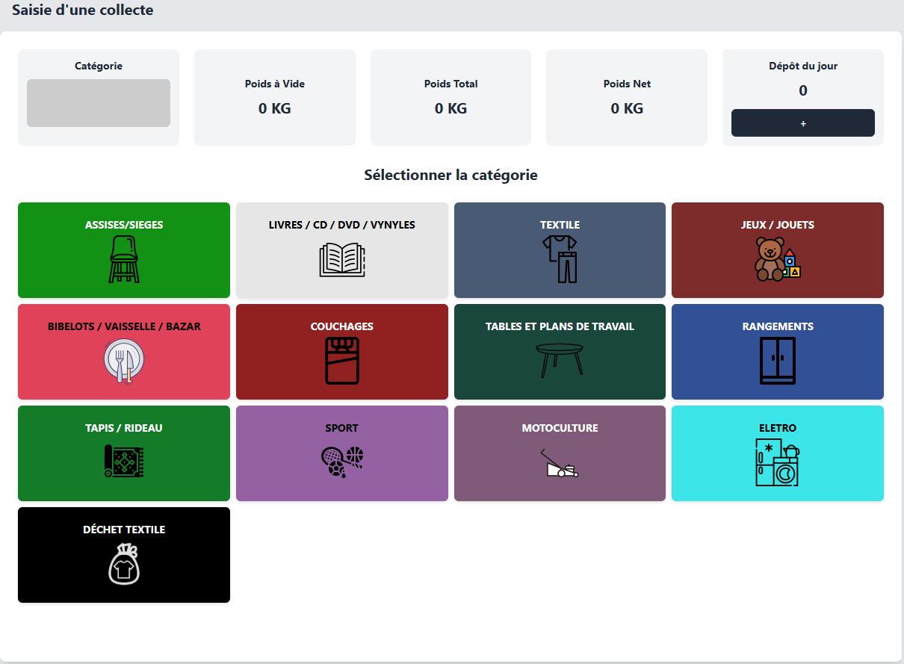

# Saisir une collecte
La saisie d'une collecte ce déroule en 4 étapes simple et rapide.  
1. La première étape consite à sélectionner une catégorie. La liste des catégorie disponible s'affiche sous formes de boutons avec un libellé et une image.

